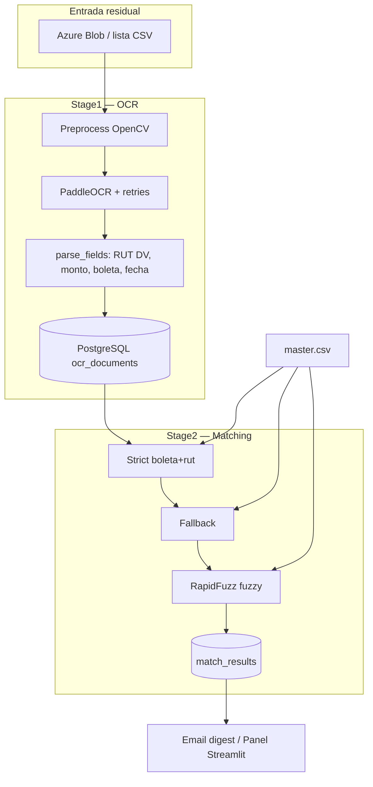

# poc-pipeline-ocr-residual

Pipeline **OCR residual** para boletas chilenas: Stage1 (OCR + persistencia) y Stage2 (matching en capas).

> Solo procesa el **residual (~30% no conciliado)**. El 70% ya matched **nunca** se reprocesa.

[](https://www.python.org/downloads/)
[](LICENSE)

## Arquitectura



Documentación detallada: [docs/ARCHITECTURE.md](docs/ARCHITECTURE.md) · [RUNBOOK.md](docs/RUNBOOK.md) · [DATA_MODEL.md](docs/DATA_MODEL.md) · [CONFIG.md](docs/CONFIG.md)

## Requisitos

- Python 3.10+
- PostgreSQL 14+
- Cuenta Azure Storage (contenedor **solo residual**)
- VM Azure típica: 2–4 vCPU, 4–8 GB RAM (`OCR_WORKERS=2`)

Dependencias OSS: `paddleocr`, `opencv-python-headless`, `rapidfuzz`, `sqlalchemy`, `psycopg2-binary`, `azure-storage-blob`, `click`, `jinja2`, `python-dotenv` (+ `streamlit` opcional).

## Instalación rápida (Azure VM)

```bash
sudo apt-get update && sudo apt-get install -y python3-venv python3-dev libgl1
git clone https://github.com/CtrlShiftCoder/poc-pipeline-ocr-residual.git
cd poc-pipeline-ocr-residual
python3 -m venv .venv && source .venv/bin/activate
pip install -U pip
pip install -e ".[dev]"
# Panel:
# pip install -e ".[panel,dev]"
cp .env.example .env
# Completar AZURE_STORAGE_CONNECTION_STRING y DATABASE_URL
```

Inicializar DB:

```bash
residual-ocr init-db
# o: psql ... -f sql/schema.sql
```

## Uso CLI

```bash
# Stage1 — OCR + glosa/campos (SIN matching)
residual-ocr stage1
residual-ocr stage1 --local-dir ./data/residual --workers 2 --limit 100

# Stage2 — strict → fallback → RapidFuzz vs maestro
residual-ocr stage2 --master samples/master.csv

# Métricas
residual-ocr stats
residual-ocr stats --json

# Panel (extra [panel])
residual-ocr panel --port 8501
```

Entry point: `residual-ocr` → `residual_ocr.cli:main`.

## Variables de entorno

Ver `.env.example` (comentarios en español, **sin secretos**).

| Clave | Default |
|-------|---------|
| `OCR_WORKERS` | `2` |
| `OCR_MAX_RETRIES` | `3` |
| `EMAIL_ON_MATCH` | `false` |
| `EMAIL_DIGEST_SIZE` | `100` |
| `MATCH_FUZZY_THRESHOLD` | `85` |

## Matching (capas)

1. **Strict**: boleta + RUT (+ monto si ambos lo tienen)
2. **Fallback**: boleta sola · RUT+monto · RUT+fecha
3. **Fuzzy**: RapidFuzz `token_set_ratio` sobre `boleta|rut|monto`

## Tests

Los unit tests **mockean OCR** (no descargan modelos Paddle):

```bash
pip install -e ".[dev]"
# Si Paddle tarda: instalar deps livianas y pytest sobre parsers/matching
pytest -q
```

## Estructura

```
src/residual_ocr/     # paquete
sql/schema.sql
docs/                 # arquitectura, runbook, modelo, config
samples/              # master.csv + residual_list.csv
tests/                # RUT, parsers, matching, email, OCR mock
```

## Licencia

MIT — ver [LICENSE](LICENSE).
