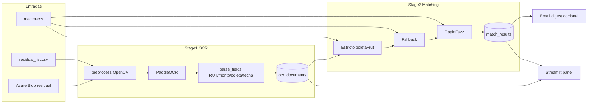

# Arquitectura — residual-ocr

## Visión

Pipeline en dos etapas para el **residual** de boletas chilenas (~30% no conciliado automáticamente). El 70% ya matched **nunca** se reprocesa.

## Componentes

| Módulo | Rol |
|--------|-----|
| `azure_blob` | Lista/descarga imágenes residuales |
| `preprocess` | Gris, deskew, CLAHE, denoise |
| `ocr` | PaddleOCR + reintentos/backoff |
| `parse_fields` | RUT DV módulo 11, monto CL, boleta, fecha |
| `db` | SQLAlchemy → PostgreSQL |
| `matching` | Capas strict → fallback → fuzzy |
| `metrics` | Agregados Stage1/2 |
| `cli` | Click: `stage1`, `stage2`, `stats`, `panel` |
| `notifications.email` | Digest Jinja2 + SMTP |

## Reglas de negocio

1. Solo residual (lista CSV o prefijo Blob dedicado).
2. Stage1 **no** hace matching; deja `status=pending_match`.
3. Stage2 es idempotente por documento pending.
4. Defaults: `OCR_WORKERS=2`, `OCR_MAX_RETRIES=3`, `EMAIL_ON_MATCH=false`, digest 100.

## Dependencias OSS

paddleocr, opencv-python-headless, rapidfuzz, sqlalchemy, psycopg2-binary, azure-storage-blob, click, jinja2, python-dotenv; streamlit opcional (`[panel]`).
